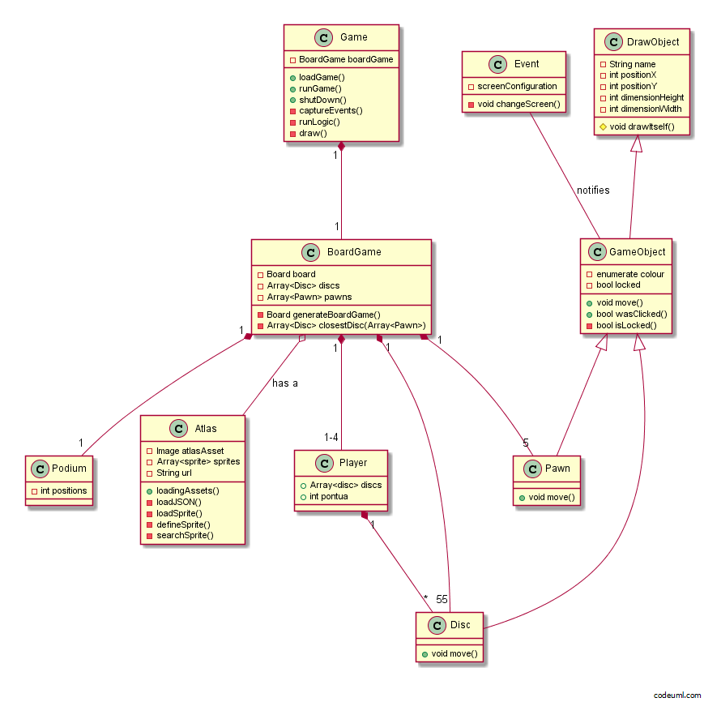

# Grandes Pontos

Jogo desenvolvido utilizando XP e boas práticas aprendido na disciplina Técnicas de Programação da Faculdade UnB Gama.

[Waffleio FAQs and Tips](https://github.com/waffleio/waffle.io/wiki/FAQs)

 

 

